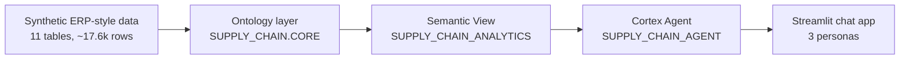

# Supply Chain Ontology & Governed Conversational Analytics

**One governed semantic layer on Snowflake, so every team gets the same answer to the same supply chain question.**

Solo entry for the **Snowflake CoCo CLI Hackathon (GCC Edition)**, built with Cortex Code CLI.

[Live demo app](https://app.snowflake.com/streamlit/xgqisoq/bc75017/#/apps/SUPPLY_CHAIN.CORE.SUPPLY_CHAIN_CHAT) (allow-listed access) | [Demo video](https://drive.google.com/drive/folders/1B2svAV2XlhocWa-PDkCDL2Q55GPBSxCR?usp=drive_link)

---

## The problem

Supply chain data is spread across ERP, logistics, supplier and IoT systems, and each team defines its metrics differently. Planning, procurement and logistics can ask "What is our on-time delivery?" and get three different numbers. Decisions stall while analysts reconcile definitions.

## The solution

Define the business meaning **once**, then put natural language on top of it.

1. **Ontology:** a business entity and relationship model with hierarchies.
2. **Semantic View:** the ontology encoded in Snowflake, with canonical metric definitions and synonyms.
3. **Cortex Agent:** answers plain-English, cross-domain questions from the semantic view and states which definition it used.
4. **Streamlit app:** a chat UI with Planning, Procurement and Logistics personas. Same question, same answer, SQL shown.

## Architecture



## The ontology

```
Supplier -> Part -> Plant -> Shipment -> Order -> Customer
                      \-> Inventory snapshot
```

| Hierarchy | Levels |
|---|---|
| Geography (plants) | Plant > Region > Country |
| Product | Part > Category |
| Customer | Customer > Country |

**11 tables:** `COUNTRY`, `REGION`, `PART_CATEGORY`, `SUPPLIER`, `PART`, `PLANT`, `CUSTOMER`, `ORDER_HEADER`, `ORDER_LINE`, `SHIPMENT`, `INVENTORY_SNAPSHOT`. Every table and column has a business description.

## Canonical metrics (defined once)

| Metric | Definition |
|---|---|
| **On-Time Delivery %** | Shipments delivered on or before `CONFIRMED_DATE` / delivered shipments. The baseline is the confirmed date, not the requested date. |
| **Fill Rate %** | Sum of shipped quantity / sum of ordered quantity. |
| **Landed Cost** | Freight + duty + handling per shipment, also available per unit shipped. |
| **Days of Inventory** | Average on-hand quantity / average consumption. Shipped quantity is the demand proxy in this MVP. |

The semantic view includes synonyms (for example "OTD" and "service level") and **10 verified queries** that act as a trusted test set.

## Governed conversational layer

- **Persona-aware:** Planning, Procurement and Logistics selectors add role context, while every persona reads the same semantic view and definitions.
- **Transparent:** the agent must state the canonical definition it used, and the generated SQL is shown in the app.
- **Guardrails:** access limited to an email allow-list, questions capped at 500 characters, 50 per session, 10 turns of history. The agent is instructed never to fabricate data.
- **Persona-consistency check:** the same questions asked as all three personas returned identical numbers and definitions.

Example questions:

- What is OTD by supplier?
- Show fill rate by plant.
- What is the landed cost by carrier?
- Days of inventory by part category.
- Who are the top 20 customers by spend?

## Repository structure

| File | Purpose |
|---|---|
| `01_ontology_ddl.sql` | Tables, keys, hierarchies and column comments |
| `02_seed_data.sql` | Synthetic data: ~20% late and ~25% partial shipments |
| `03_semantic_view.sql` | Semantic view with relationships, metrics, synonyms and verified queries |
| `04_agent.sql` | `SUPPLY_CHAIN_AGENT` on Cortex Analyst |
| `streamlit_app.py` | Streamlit chat app |
| `snowflake.yml`, `pyproject.toml`, `environment.yml` | App deployment and dependencies |

## Run it yourself

**Prerequisites:** a Snowflake account with Cortex features enabled, a warehouse named `COMPUTE_WH`, and the [Snowflake CLI](https://docs.snowflake.com/en/developer-guide/snowflake-cli/index).

1. In Snowsight, create the database and schema (`SUPPLY_CHAIN.CORE`), then run the scripts in order: `01` > `02` > `03` > `04`.
2. In `streamlit_app.py`, replace the `ALLOWED_EMAILS` set with your own users.
3. Deploy the app from the project folder:

```bash
snow streamlit deploy --replace
```

`snowflake.yml` expects the compute pool `SYSTEM_COMPUTE_POOL_CPU` and an external access integration named `PYPI_ACCESS_INTEGRATION`. Adjust them to match your account.

## Limitations and next steps

- **All data is synthetic.** No real company data is used.
- **Days of Inventory** uses shipped quantity as a demand proxy, not true daily consumption.
- **IoT telemetry** (for example temperature) is not part of this MVP.
- **Next:** real ERP, WMS and TMS extracts, IoT events on shipments, supplier contracts and emails through Cortex Search, and role-based masking and row policies.

## Built with

Snowflake Semantic Views, Cortex Analyst, Cortex Agents, Streamlit in Snowflake, and Cortex Code CLI.

## Author

**Tarun Jindal** | [GitHub](https://github.com/tjindal2026)

## License

MIT. See [LICENSE](LICENSE).